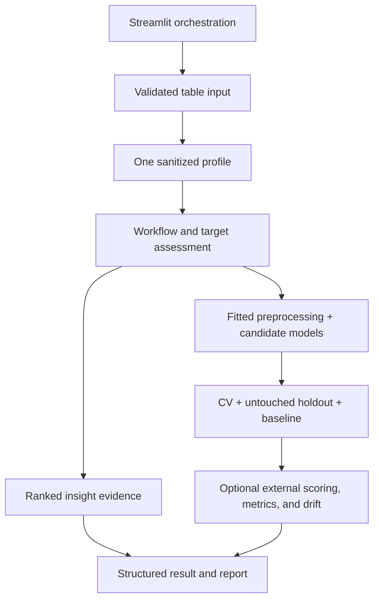

# DataLens architecture and methodology

## Product boundary

DataLens is a Streamlit application for first-pass tabular analysis. Its central
decision is whether a dataset supports a credible supervised outcome or should
remain insight-first. It is not an AutoML platform, causal-analysis engine,
feature store, or production model-serving system.

## Runtime architecture

The active code is divided by responsibility:

- `app.py` owns source selection, session-scoped state, staged progress, result
  presentation, and downloads.
- `src/data_io.py` validates supported files, normalized headers, size/shape
  limits, schema previews, and formula-safe CSV output.
- `src/contracts.py` defines the structured profile, configuration, analysis,
  fitted-model, and scoring contracts passed between stages.
- `src/modeling.py` owns train-only feature transformation, cross-validation,
  candidate estimators, holdout metrics, baselines, and permutation importance.
- `src/scoring.py` owns raw-schema coercion, prediction/evaluation, drift,
  identifier overlap, and external readiness.
- `src/pipeline.py` coordinates sanitation, role/target assessment, fitted
  preprocessing, model selection, validation, scoring, and readiness decisions.
- `src/insights.py` produces ranked data-quality, distribution, association,
  trend, multi-value, unit-bearing, and anomaly evidence.
- `src/reporting.py` turns structured results into a reproducible Markdown
  report without recomputing analysis.
- `src/extensions.py` and `src/ai_assistant.py` provide isolated advisory hooks;
  deterministic decisions remain authoritative.

The former experimental training, evaluation, explanation, preprocessing, and
utility modules were removed after import tracing and regression tests confirmed
that the focused layers above fully replace them.

## Stable contracts

- `DatasetProfile` carries sanitized schema, exact table counts, inferred column
  roles, a deterministic analysis sample, target candidates, warnings, and a
  content fingerprint.
- `AnalysisConfig` fixes target, validation strategy, positive label, effort,
  split size, and random seed.
- `ModelBundle` keeps the raw input schema, fitted transformations and estimator,
  label semantics, baseline, feature names, and version metadata needed later.
- `AnalysisResult` carries the workflow decision, ranked insights, internal
  validation, limitations, and optional fitted bundle.
- `ScoringResult` carries original rows plus predictions/probabilities, schema
  warnings, drift evidence, and external metrics when labels are available.

These are data-transfer contracts. UI code renders them but does not recreate
model or insight logic.

## Methodology

### Ingestion and profiling

CSV, TSV, TXT, and XLSX inputs are parsed once. Blank and whitespace-only names
are normalized, but duplicate names after trimming are rejected. Accepted tables
are bounded by bytes, rows, columns, and cells. Profile sanitation normalizes
documented missing tokens while retaining exact dataset-level counts. Numeric-
string and other learned conversions are fitted from training rows only, after
the final holdout is separated. Expensive analysis uses a seeded sample.

### Workflow and target decision

Role heuristics distinguish identifiers, categories, numbers, dates, text, and
possible outcomes. Token-aware identifier rules avoid treating any name that
merely contains `id` as an identifier. A column may be technically modelable
without being credible enough for automatic target selection. Users can still
choose a plausible manual target and receive its cautions.

### Modeling and internal validation

The final holdout is separated before model selection. Imputation, encoding,
derived fields, and any frequency or unit transformations are fitted from
training rows only. Standard effort uses three-fold cross-validation; Expanded
uses five. Classification uses one explicit positive label consistently across
thresholding, probabilities, confusion metrics, average precision, ROC-AUC, and
exports. Candidate results are compared with a baseline evaluated on the same
holdout. Internal conclusions remain provisional until external validation.

Reported classification evidence includes balanced accuracy, macro/weighted F1,
per-class support, and AP/AUC when defined. Regression reports scale-aware error
and baseline-relative improvement. Holdout permutation importance is labeled
"predictive association."

### Leakage, scoring, and external validation

Checks cover identifier/entity overlap, duplicate or near-deterministic target
proxies, post-outcome fields, target-derived values, and time ordering. Scoring
coerces compatible numeric representations, allows extra fields and unseen
categories with warnings, and blocks only absent required raw features. Original
rows and identifiers remain in row order beside predictions and per-class
probabilities.

When labels are present, scoring also evaluates external performance. Drift
evidence covers numeric standardized differences, categorical total variation,
missingness, unseen categories, target prevalence, and entity overlap. A primary
metric drop of at least 0.10, or performance within 0.05 of baseline, forces a
"not deployment-ready" conclusion.

### Insight evidence

Insight families are ranked by support and signal. Multi-value categories are
exploded before counting; movie minutes and TV seasons are kept separate.
Trends default to complete-period row counts unless a metric is explicitly
selected. Correlation headlines require adequate paired support and coverage and
include effect size, paired count, and adjusted significance. Robust anomaly
rows appear only when they cross the documented threshold. Language stays
associational and calls out protected attributes and other responsible-use risk.

## Verification and release

Fast pull-request tests exercise full profiles and bounded model samples. The
scheduled and release workflows run the complete fixture matrix, including all
64,374 external churn rows. The fixture manifest records hashes, provenance,
licenses, schemas, and acceptance facts. CI also runs Ruff, branch coverage,
dependency and secret checks, and a built-container health/vulnerability check.

A release is complete only after fixture, UI, performance, security, container,
documentation, and clean-deployment smoke tests pass twice and the public demo
URL replaces the README placeholder.
