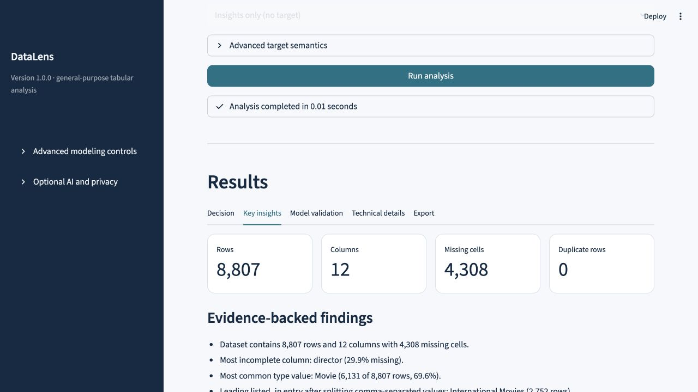
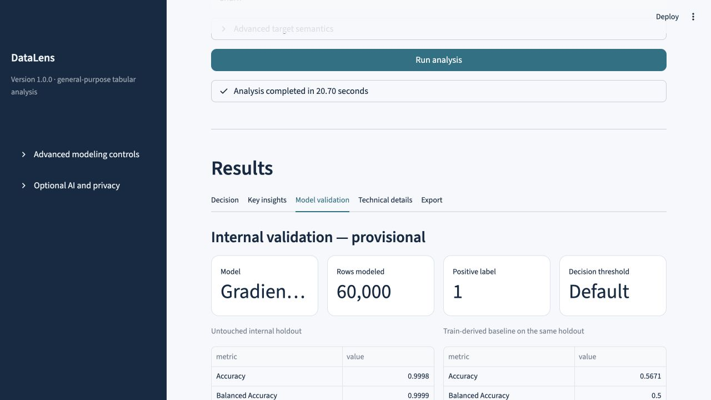
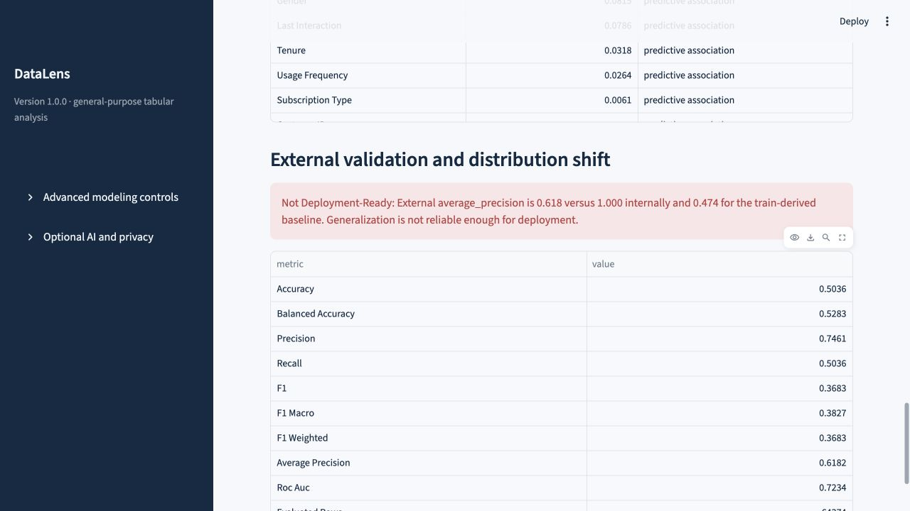
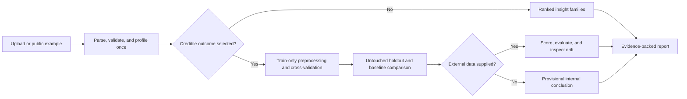

# DataLens

**Dataset intelligence that knows when not to model.**

DataLens is a Streamlit app for defensible first-pass analysis of unfamiliar
tabular data. It profiles a table, ranks useful analysis paths, recommends
insights or supervised prediction, validates models against a baseline, and
explains the evidence and limitations behind that decision.

> **Release status:** v1.0 release candidate. The public Streamlit Community
> Cloud URL is a deployment placeholder until the release checks pass and the
> app is deployed from `main`.

## What it does

- Reads CSV, TSV, TXT, and XLSX files, with normalized-header and shape checks.
- Enforces a 50 MB upload limit and boundaries of 1,000,000 rows, 500 columns,
  and 20 million cells.
- Reports schema, coverage, missingness, duplicates, constants, distributions,
  multi-value categories, unit-bearing durations, trends, and robust anomalies.
- Keeps ordinary measures available for manual selection while only
  auto-selecting high-confidence outcome targets.
- Handles numeric, boolean, category, object, and pandas string predictors in a
  fitted preprocessing/model pipeline.
- Uses holdout and cross-validation evidence, an explicit positive class, and a
  naive baseline before recommending a predictive result.
- Scores compatible data without rejecting safe integer/float differences,
  preserves original rows and identifiers, and reports external metrics and
  distribution shift when the target is present.
- Exports formula-safe scored CSV files and a Markdown report containing method,
  validation, limitations, and readiness notes.

DataLens is intentionally not a full AutoML, causal-inference, or production
decision system. A weak model becomes an insight-first result instead of being
presented as success.

## Quick start

### Docker

```bash
git clone https://github.com/atbianc0/dataset-insight-app.git
cd dataset-insight-app
docker compose up --build
```

Open [http://localhost:8501](http://localhost:8501). Stop with `Ctrl+C`, then run
`docker compose down` if needed.

### Local Python

Use Python 3.11 or 3.12.

```bash
python -m venv .venv
source .venv/bin/activate
python -m pip install --upgrade pip
python -m pip install -r requirements.txt
streamlit run app.py
```

On Windows PowerShell, activate with `.venv\Scripts\Activate.ps1`.

## Included examples

The start screen includes two public example journeys plus upload:

| Example | Intended behavior |
| --- | --- |
| Netflix titles | Insight-first analysis of 8,807 rows, including content types, missing directors, exploded countries/genres, partial-2021 coverage, and separate movie-minute/TV-season summaries. |
| Customer churn + validation | Train on 440,832 usable targets, preserve `CustomerID`, then evaluate all 64,374 external rows and surface identifier overlap, drift, and any generalization failure. |

Exact fixture hashes, source licenses, schemas, and acceptance facts live in
[`sample_data/fixtures.json`](sample_data/fixtures.json). See
[`DATASETS.md`](DATASETS.md) before reusing the data.

## Product tour

The Netflix journey reports exact table facts and separates defensible findings
from technical detail without inventing a prediction target.



The churn journey keeps strong internal validation provisional, evaluates the
complete paired fixture, and visibly downgrades deployment readiness when that
performance does not generalize.





## Reference performance

On the documented Apple M1 development machine, all release targets pass:

| Gate | Observed | Target |
| --- | ---: | ---: |
| Netflix profile | 0.21 s | < 3 s |
| Churn testing profile | 0.35 s | < 8 s |
| Full churn training profile | 2.37 s | < 20 s |
| Standard training + complete external evaluation | 11.34 s | < 60 s |
| Peak memory for the end-to-end workflow | 1.08 GiB | < 1.5 GB |

The benchmark uses the checked-in fixture hashes, a deterministic 60,000-row
training sample, and all 64,374 external rows. Machine, command, and result
details are versioned in [`benchmarks/v1_reference.json`](benchmarks/v1_reference.json).

## How analysis works



The app describes model features as **predictive associations**, not causal
drivers. Correlation headlines require adequate paired support and coverage;
low-support findings stay in technical detail. See
[`PROJECT_BREAKDOWN.md`](PROJECT_BREAKDOWN.md) for architecture and methodology.

## Privacy and optional AI

The deterministic app needs no API key. User uploads are processed in the
running Streamlit session and are not intentionally written to a database or
artifact store by DataLens. Only checked-in public examples may use shared app
caching. The deployment operator is still responsible for server memory, logs,
network controls, platform retention, and access policy.

The OpenAI assistant is optional, advisory, and off by default. It appears only
when `OPENAI_API_KEY` is configured and runs only after the user explicitly
enables it. Requests contain bounded aggregate/schema context—such as column
names, roles, coverage, candidate summaries, and analysis headlines—not uploaded
rows, sample values, or identifier values. Requests leave the app process and are
subject to the configured OpenAI account's terms and controls.

For local opt-in use:

```bash
OPENAI_API_KEY="your-key" docker compose up --build
```

The public demo is designed to run without an OpenAI secret.

## Responsible use

- Review target meaning, label semantics, time ordering, and leakage with a
  domain expert before acting on a result.
- Treat age, gender, and other protected or proxy attributes as sensitive. A
  statistical association does not justify eligibility, employment, credit,
  health, housing, insurance, or other high-impact decisions.
- Internal validation is provisional. External degradation or near-baseline
  performance means the model is not deployment-ready.
- Check support counts, uncertainty, missingness, and drift; do not rely on a
  headline or feature-importance ranking alone.
- Use only data you are authorized to process, and obtain independent privacy,
  fairness, security, and legal review for real deployments.

## Development and tests

Install the development pins, then run the same primary checks as CI:

```bash
python -m pip install -r requirements-dev.txt
python -m ruff check app.py src tests
python -m pytest -W error
python -m pytest --cov=src --cov-branch --cov-report=term-missing
python -m pip_audit -r requirements.txt
```

Or use `make check`. CI covers Python 3.11 and 3.12, secret scanning, dependency
auditing, container build/health, and container vulnerability scanning.
Pull-request checks cap model-oriented fixture work at 10,000 rows. The
scheduled/full workflow sets the 60,000-row training and complete 64,374-row
external-validation gates before a release.

To run the production image directly:

```bash
docker build --tag datalens:local .
docker run --rm --publish 8501:8501 datalens:local
```

## Deploy

For Streamlit Community Cloud, create an app from
`atbianc0/dataset-insight-app`, select branch `main`, entrypoint `app.py`, and
Python 3.12. Keep `OPENAI_API_KEY` unset for the public deployment. After the
deployment passes the upload and both example smoke tests, replace the release
status placeholder at the top of this file with the real public URL.

Pinned runtime dependencies are in `requirements.txt`; Docker uses the same
file. Do not publish a `v1.0.0` tag until CI, full-fixture tests, a clean-container
health check, documentation review, and deployed smoke tests all pass twice.

## Limitations

- Target and leakage recommendations are heuristics and require domain review.
- Training is single-target even when related target families are identified.
- Correlation, permutation importance, and group differences are associational.
- Very high-dimensional text, images, nested data, geospatial data, streaming
  input, and domain-specific time-series modeling are out of scope.
- Large inputs are sampled deterministically for expensive analyses and model
  fitting; exact table-level counts still use the full accepted dataset.
- Session-local operation is not a guarantee about a third-party hosting
  platform's infrastructure or retention.

## Contributing, security, and licenses

See [`CONTRIBUTING.md`](CONTRIBUTING.md) for the development workflow and
[`SECURITY.md`](SECURITY.md) for private vulnerability reporting. DataLens code
is licensed under the [MIT License](LICENSE). Bundled datasets retain their own
licenses as documented in [`DATASETS.md`](DATASETS.md).
